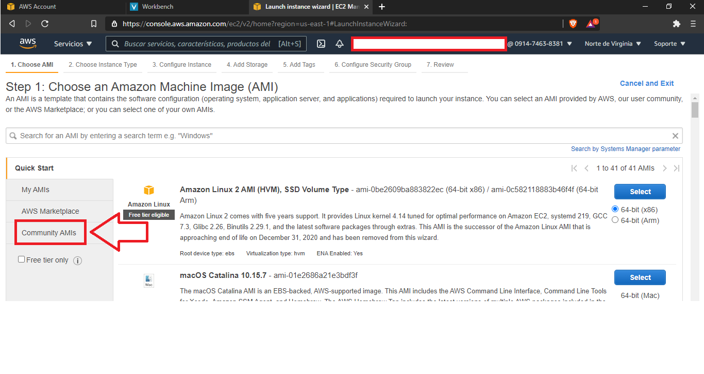
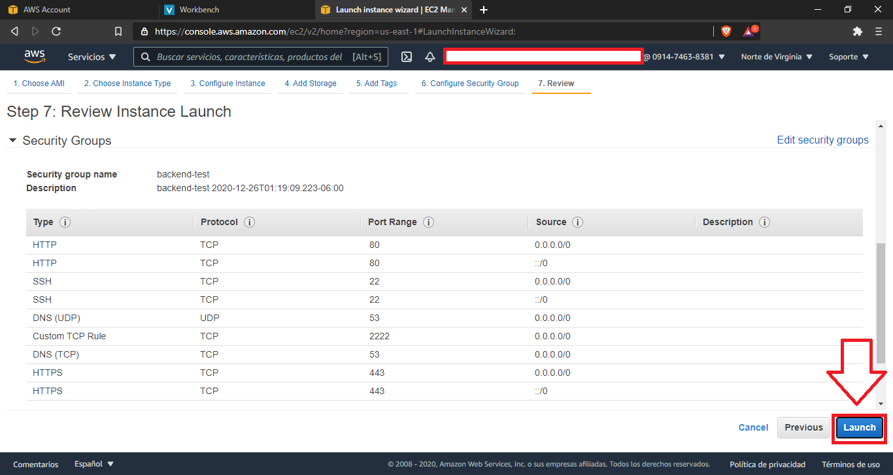
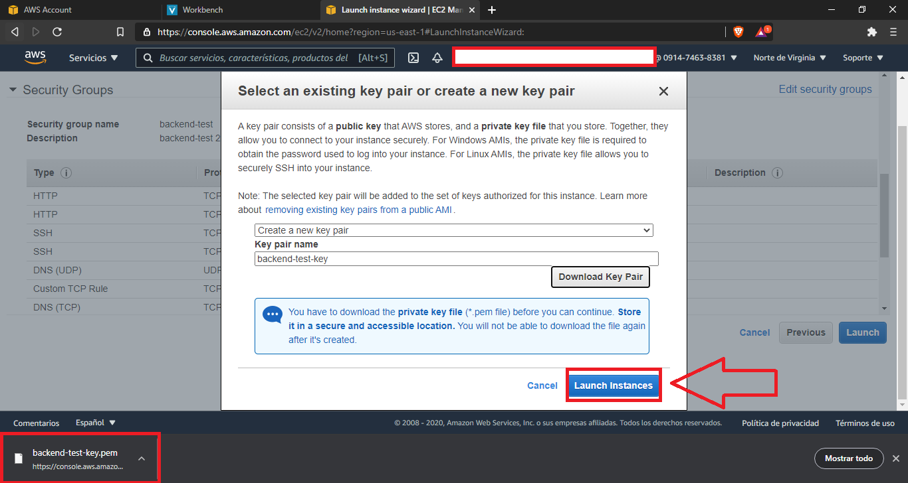
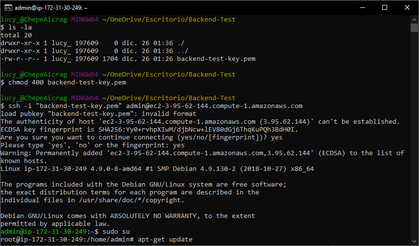
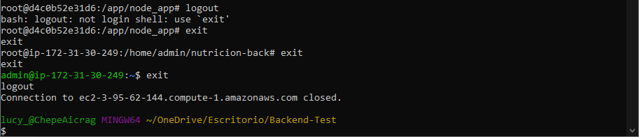

# Deploy-Backend-Docker-AWS 
___

Manual para hacer deploy del backend (Node js, Sequelize, Express) dockerizado (docker-compose) en AWS utilizando el servicio de EC2.
****

## Requisitos
---
* Cuenta de AWS Educate o AWS
* Código en un repositorio de GitHub o GitLab o cualquier otro hosting de repositorios

## Acceso  a AWS Console
---
1. Acceder a [AWS Educate](https://www.awseducate.com/student/s/).
   
2. Iniciar sesión.
3. Acceder a <span style="color:green" >AWS Account</span>.
   
4. Dar clic en <span style="color:green" >AWS Educate Starter Account</span> y este te redireccionará a una página de Vocareum.
   
5. Aquí se muestra información sobre los creditos que tiene la cuenta actualmente. 
   
   Dar clic en <span style="color:green" >AWS Console</span> y te redireccionará a la Consola de administración de AWS
   
## Creación y Lanzamiento de Instancia
----
1. Ya en AWS Console y justamente en el panel, seleccionar el servicio de EC2.
   
   

2. En el panel, scrolear un poco hacia abajo para visualizar *Lanzar la instancia* y ahí dar clic en <span style="color:green"> Lanzar la instancia</span>.
   
   

3. Ir al apartado de <span style="color:green">Community AMIs</span>.
   
   

4. Seleccionar *Debian* y la primer imágen, en este caso <span style="color:gray">*debian-stretch-hvm-x86_64-gp2-2019-01-22-59357*</span> dar clic en <span style="color:green">Seleccionar</span>.
   
   

5.  Seleccionar la opción que brinda <span style="color:gray">Free tier eligible</span>, viene por default pero verifica que así sea. 
   
      Luego da clic <span style="color:green">Next: Configure Instance Details</span>. 

      

6.  Deja por default como está, solo revisa que sea igual a las siguientes imagenes. 

      

    Finalmente da clic en <span style="color:green">Next: Add Storage</span> para continuar. 
      
7.  Aquí modifica de 8 a 30 y además verifica que esté habilitada la opción de *Delete on Termination*. Posterior a ello, da clic en <span style="color:green">Next: Add tags </span>.

      

8.  No vamos a agregar ningún tag así que se omite este proceso. Clic en <span style="color:green">Next: Configure Security Group </span> para continuar.
  
      

9.  Vamos a crear un nuevo grupo de seguridad. Se tiene que agregar cada regla de acuerdo a nuestras necesidades, en mi caso con esas basicas me es suficiente. Si llegaras a requerir de otras relgas, no hay problema, se pueden editar. Clic en <span style="color:green">Next: Review </span> para continuar.
    Información incial:

    

    Despues de configurar

    

10. Revisa que todas las configuraciones sean las correctas e iguales a las que necesitas. Luego da clic en <span style="color:green">Launch  </span> para finalizar.
    
    

    

11. Ahora, nos solicitará selecionar o crear las llaves de acceso a nuestra instancia. Para esto vamos a crear una nueva Key Pair, simplemente colocalos un nombre y luego damos clic en <span style="color:green"> Download Key Pair</span>.
   
      **Importante:**<span style="color:red"> No se pueden volver a descargar, así que guardarlas muy bien</span>. 
    
    

      Luego de descargarlas, procedemos a dar clic en <span style="color:green"> Launch instances</span>. 
    
      

12. Si hemos realizado todos los pasos bien, vamos a tener un mensaje como el siguiente, en el que se nos indica que la instancia ya está lista.    
    
    

      Y luego damos clic en <span style="color:green"> View Instances</span>.
      
      

14. Visualizamos las instancias que tenemos, en mi caso tengo dos, una que recién acabo de crear y una anterior. 
    
    Seleccionamos la que recién creamos y podemos visualizar información de la misma.
      
      
## Conexión a instancia
---
Esto depende del tipo de instancia que se haya creado. 
1. Seleccionar la instancia a la que deseamos conectar (Si no haz creado alguna con anterioridad solo aparecerá la recién creada). 
2. En la parte superior derecha seleccionar <span style="color:green">Acciones</span>.
3. Y de acciones, seleccionar <span style="color:green">Conectar</span>.
   
    

4. Ir al apartado *Conexión con SSH*. Aquí se enocntrará cada uno de los pasos a realizar conexión con la instancia. 
    
    

5. Dirigirse a la ruta donde se alamacenó el archivo *.pem*. Comprobamos ejecutando *pwd*, en mi caso es la carpeta *Backend-Test*. 
   
   Listamos con propiedad para visualizar los permisos del archivo. 
       
      

6. Procedemos a cambiar los permisos, para ello ejceutamos. Donde name_file.pem es el nombre que le hayas colocado a tus keys. 
   
    ```bash
    chmod 400 name_file.pem
    ``` 

7. Luego se ejecuta el comando de ejemplo que proporciona la documentación. En mi caso se ejecuta el comando:
    
    ```bash
    ssh -i "backend-test-key.pem" admin@ec2-3-95-62-144.compute-1.amazonaws.com
    ```

8.  Responde con *yes* para contitnuar.
    
      *Ejecución del paso 6, 7 y 8:*

       

9.  Y listo, ya estamos conectados a nuestra instancia. 
    
    

10. Ahora, les recomiendo ejecutar los demás comandos desde el usuario root, para eso accedemos a el, ejecutando: 
    
    ```bash
    sudo su
    ```
    
    

11. Tammbién les recomiendo hacer un update. En mi caso al ser Debian, se actualiza mendiante:  
    
    ```bash
    apt-get update
    ```
    
    
12. Así mismo ejecutar: 
    
    ```bash
    apt-get upgrade
    ```    
    
    
## Instalación de herramientas
---
### Git 
___
1. Primeramente verificamos si ya está instalado, esto ejecutando:
   
   ```bash
   git --version
   ```

2. Si no está instalado, como en mi caso, se procede a ejecutar el comando: 
   
   ```bash
   apt-get install git
   ```

   

3. Verificamos que se haya instalado correctamente: 
   
   ```bash
   git --version
   ```
### Docker && Docker Compose
___
1. Primeramente verificamos si ya está instalado, esto ejecutando:
   ```bash
   docker --version
   ```
   

2. Si no está instalado, procedemos a instalarlo, esto en base a la documentación. En cada distro o imágen se instala diferente, así que es importante que revisen la documentación [aquí](https://docs.docker.com/engine/install). 

   En este caso haré la instalación para Debian, así que procedemos a ejecutar: 

   1. ```bash
      sudo apt-get update
      ```   

   2. ```bash
      sudo apt-get install \
      apt-transport-https \
      ca-certificates \
      curl \
       gnupg-agent \
      software-properties-common
      ```

      *Pasos 1 y 2:*
      
      
      
   3. ```bash
      curl -fsSL https://download.docker.com/linux/debian/gpg | sudo apt-key add -
      ```
      
   4. ```bash
      sudo apt-key fingerprint 0EBFCD88
      ```
      
   5. ```bash
      sudo add-apt-repository \
      "deb [arch=amd64] https://download.docker.com/linux/debian \
      $(lsb_release -cs) \
      stable"
      ```
   
      *Pasos 3, 4 y 5:*

      

   6. ```bash
      sudo apt-get update
      ```

   7. ```bash
      sudo apt-get install docker-ce docker-ce-cli containerd.io
      ```

      *Pasos 6 y 7:*
         
         

3. Finalmente comprobamos ejecutando: 

   ```bash
   docker --version
   ```

   

4. Ahora, para cualquier distro de Linux, se procede con lo siguiente para instalar *Docker Compose* , que es de acuerdo a la documentación que se puede encontrar [aquí](https://docs.docker.com/compose/install).

   Entonces, ejecutamos los siguientes comandos: 

   1. ```bash
      sudo curl -L "https://github.com/docker/compose/releases/download/1.27.4/docker-compose-$(uname -s)-$(uname -m)" -o /usr/local/bin/docker-compose
      ```

   2. ```bash
      sudo chmod +x /usr/local/bin/docker-compose
      ```
   Verificamos que haya sido correcto la instalación, ejecutando:

   ```
   docker-compose --version
   ```

   *Ejecución de todos los pasos anteriores*.

   
### Nginx
___
Esto es muy seguro de que no esté preinstalado, así que instalamos directamente. Dependiendo de la imagen que tengamos es como instalaremos, para eso revisa la documentación de nginx [aquí](https://www.nginx.com/resources/wiki/start/topics/tutorials/install/).

La instalación para Debian es tan sencillo como ejecutar:

```
apt-get install nginx
```


## Revisión de nginx
---
Hasta este punto, nuestra instancia ya tiene nginx en ejecucción. Esto lo podemos probar accediendo a la *Dirección IPV4 pública*. Esta se encuentra en la información de nuestra instancia. 

En mi caso es *3.95.62.144*, como se observa en la siguiente ilustración:


Entonces, si accedo a *http://3.95.62.144*. Ojo, aquí tiene que ser mediante `http` porque todavía no se ha configurado para `https`. 

Al acceder se verá el *Welcome to nginx!*: 


## Clonación de proyecto de GitHub
---
Ahora, procedemos a clonar nuestro proyecto almacena en GitHub.

Accdemos a la carpeta del proyecto y comprobamos que se encuentra nuestros archivos completos. 

Para este caso es necesario que se tenga el archivo *docker-compose.yml*. 


## Configuración nginx
---
Primeramente, vamos a borrar la configuración *default* que trae nginx. 

```bash
rm /etc/nginx/sites-available/default /etc/nginx/sites-enabled/default
```

Y procedemos a crear nuestro archivo de configuración, en mi caso le pondré *nutricion* pero puede el nombre que gusten. Y tiene que estar en la ruta donde estaba el *default*.

```bash
nano /etc/nginx/sites-available/nutricion
```


Y en este archivo, colocamos la configuración de nginx, en mi caso es la siguiente, recomiendo leer la documentación de nginx para entender esta configuración.

```nginx
#Configuración de Nginx
upstream appname {
        server 127.0.0.1:8080;
}
server {
        listen 80;

        root /app/node_app;

        server_name api.midominio.com;

        location / {
                proxy_pass http://appname/;
                proxy_set_header X-Forwarded-Proto https;
                proxy_set_header Host $host:$server_port;
                proxy_set_header X-Forwarded-For $host;
                proxy_set_header PROXY ""; #httpoxy vuln
                proxy_redirect off;
        }

#        location /media/ {
#                alias /home/appuser/apiapp/media/;
#        }


        # deny access to .htaccess files, if Apache's document root
        # concurs with nginx's one
        #
        location ~ /.git {
                deny all;
        }
}
```

**NOTA:** Esta configuración la puedes adpatar a tus necesidades, por ejemplo: 
1. El puerto donde corre el servidor, en mi caso es 8080.
2. La dirección donde está los archivos de la aplicación, esto puede ser el *WORKDIR* en tu Dockerfile. 
3. El `server_name` también puede ser el que gustes. 
4. El `upstream appname`, donde appname puede ser sustituido por el que gustes. Si se modifica este, también la linea de `http://appname/;`.
   


Ahora, debemos crear un enlace simbolico, hacia la ruta de /etc/nginx/sites-enabled/. En mi caso ejecuto el siguiente comando, donde *nutricion* es el nombre de mi archivo:

```bash
ln -s /etc/nginx/sites-available/nutricion /etc/nginx/sites-enabled/nutricion
```

Y listo, la configuración del nginx está completa. Podemos reiniciar el servicio de nginx. 

```bash
systemctl restart nginx
```
## Ejecucción de la aplicación
---
Ahora, nos situamos dentro de nuestro proyecto, donde tenemos nuestro proyecto recién clonado y donde está el archivo *docker-compose-yml*.

El archivo [docker-compose](docker-compose.yml) contiene lo necesario para el ejemplo presentado, así mismo está el archivo [Dockerfile](Dockerfile) y [.env](.env) que son empleados en el docker-compose. Puedes observar el contenido de estos archivos y tomarlo para ajustarlo a tus necesiades. 

Ejecutamos la aplicación, mediante: 

```docker
docker-compose up -d --build
```


Esperamos que se construyan las imagenes de docker. Y al terminar esto, verificamos que nuestra aplicación esté correindo, esto ejecutando: 

```docker
docker ps
```


Luego de esto, reiniciamos el servicio de nginx si es que no lo había hecho o igual lo podemos volver a hacer sin problemas. Para ello ejecutamos:

```bash
sytemctl restart nginx
```

## Test de Aplicación
---
Ahora, ya está nuestra aplicación en ejecucción. Para eso lo verificamos de forma local con el comando: 

```bash
curl http://localhost:8080
```

Donde obtengo de salida: 


En mi caso, no tengo ningún endpoint con esa ruta, es por eso que me arroja este mensaje. 

Ahora, probamos desde fuera, accediendo a la dirección pública de nuestra instancia, en mi caso es *http://3.95.62.144*, mediante nuestro navegador. 


Y obtenemos el mismo resultado que en local, ahora ya no está el *Welcome to nginx* y ya está nuestra aplicación desplegada. 

**NOTA:** Hasta este punto, falta configurar las peticiones *https* desde nginx. Y también falta la ejecución de migraciones, si es que las necesitamos.
## Ejecución de migraciones de Sequelize
---
Probaré un endpoint que hace una consulta en la base de datos, este es */v1/web/aliments-categories*. 
El cual es el siguiente: 


Notese, que he tenido un error, esto porque la tablas no se han creado todavía, ya que necesito ejecutar unas migraciones al iniciar por primera vez. Si es tu caso, puedes seguir los siguientes pasos.
### Ejecución de migraciones.
___
En este caso, *app* es el nombre del contenedor donde está la aplicación y accedo a ella mediante el usuario root.

```docker
docker-compose exec -u root app /bin/bash
``` 

Y verificamos, listando para ver los archivos de nuestra aplicación. 

```bash
ls
```


Y ahora, ejecutamos las migraciones, en mi caso, al usar Sequelize, el comando es el siguiente:

```bash
sequelize db:migrate --url "postgres://postgres:tucontraseña@db:5432/Nutricion_dev"
``` 


Para más información sobre las migraciones de Sequelize, visita la documentación [aquí](https://sequelize.org/master/manual/migrations.html). También se pueden ejecutar los seeders desde aquí.

Y ahora, si vuelvo a probar el endpoint */v1/web/aliments-categories*, en esta ocasión no habrá error, solo retornará un array vacío. 


Si hago un `POST` desde *insomnia* para agregar información utilizando ya la dirección pública de la instacia *http://3.95.62.144*, puedo comprobar que esta funciona correctamente. 

Así como se aprecia en la imagen: 


Y nuevamente, hago otro:


Finalmente, reviso el endpoint */v1/web/aliments-categories*, observaré que ahora si me arroja lo que recientemente agregué. 


Finalmente, cierro todas las sesiones
1. De donde está mi aplicación
2. Luego de root de la instancia 
3. Finalmente de la instancia.  



Listo, hemos hecho el deploy del backend y la prueba del mismo.